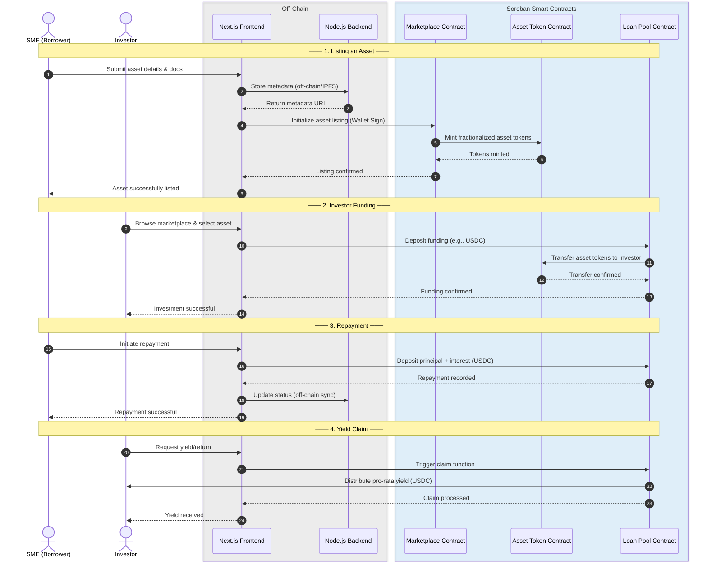

# RWA Credit Marketplace

A decentralized marketplace for fractionalized private credit and equipment financing on Stellar (Soroban).

SMEs and engineering firms tokenize physical assets (machinery, fleets, hardware) to raise capital. Global investors fund fractionalized loans and earn yield tied to real-world asset utilization.

## Architecture

```
rwa-credit-marketplace/
├── contracts/        # Soroban smart contracts (Rust)
├── backend/          # Node.js/Express REST API
├── frontend/         # Next.js app
└── docker-compose.yml
```

## Contracts

- **asset_token** – SPL-style token representing a fractionalized RWA
- **loan_pool** – Manages loan lifecycle: funding, repayment, yield distribution
- **marketplace** – Lists assets, matches investors, handles offers

## System Architecture & Interaction Flow



## Quick Start

```bash
cp .env.example .env
docker-compose up
```
